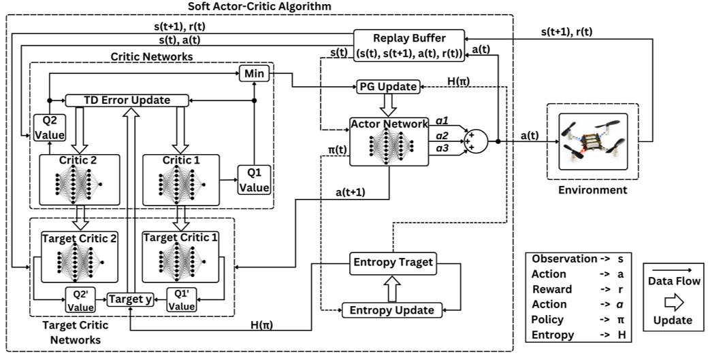

# Flight Control of a Multicopter using Reinforcement Learning

## Description
This thesis explores the impact of dynamic entropy tuning in Reinforcement Learning (RL) algorithms that train a stochastic policy. Its performance is compared against algorithms that train a deterministic one. Both algorithms are widely used for designing quadcopter low-level controllers. Stochastic policies optimize a probability distribution over actions to maximize rewards, while deterministic policies select a single deterministic action per state. The effect of training a stochastic policy and then executing deterministic actions in controlling the quadcopter is explored. Then it was compared against training a deterministic policy and executing deterministic actions. For the purpose of this research, the Soft Actor-Critic (SAC) algorithm was chosen for the stochastic algorithm while the Twin Delayed Deep Deterministic Policy Gradient (TD3) was chosen for the deterministic algorithm. Dynamic entropy tuning in SAC algorithm is done online to accommodate any training demands. The training and simulation results show the positive effect the dynamic entropy tuning has on controlling the quadcopter by preventing catastrophic forgetting and improving exploration efficiency. This thesis also proposes a new RL based control architecture for quadrotors. With the literature focusing on controlling the four rotors' RPMs directly, this paper aims to control the quadrotor's thrust vector. The RL agent computes the percentage of overall thrust along the quadrotor's z-axis along with the desired Roll and Pitch angles. The agent then sends the calculated control signals along with the current quadrotor's Yaw angle to an attitude PID controller. The PID controller then maps the control signals to motor RPMs. Training results show the faster training time of the proposed thrust vector controller in comparison to the conventional RPM controllers. Simulation results show smoother and more accurate path-following for the proposed thrust vector controller.

## Academic Acheivements
This thesis resulted in the publication of three different IEEE conference papers with one paper receiving the `best paper award` and received `A+` grade